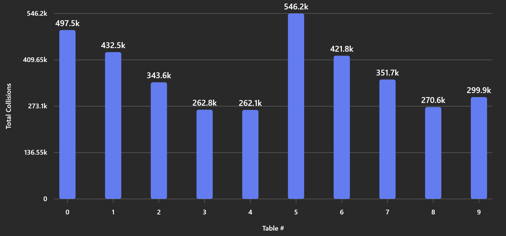
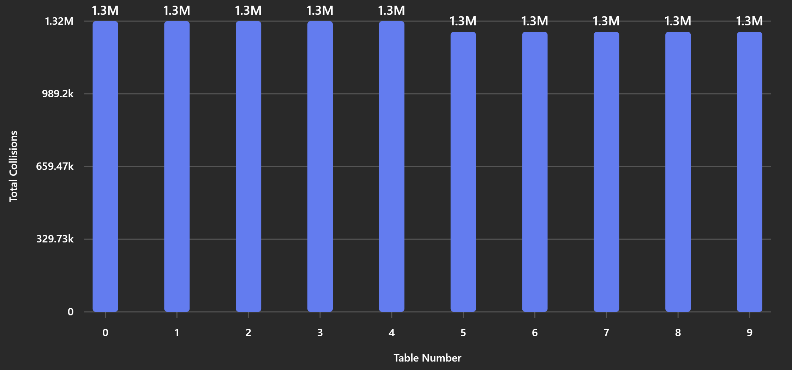

# Project 5 Report

Answer the following prompts directly in this file:
* Information about your dataset. You will be assigned a different grader for this project.
* Which Open Addressing hash tables change size during the program? Why?
* Create graphs for the number of collisions for inserting your dataset into all 20 hash tables.
  * Clearly label the graph titles and axes.
  * Set up the graph in a way that makes the most sense to you. Here are some options I have seen before:
    * Using a line graph to track the *individual* collision counts as each insertion is made. High-valued blips happen in open addressing when rehashes occur.
    * Using a line graph to track the *cumulative* collision count as each insertion is made. Vertical jumps happen in open addressing when rehashes occur.
    * Using a line graph to track the *average* number of collisions per insertion, where each hash table has one value and you can see the trends as the initial table size grows.
* Using the graphs, analyze why the collision counts are different for the different size hash tables. Use what you know about your keys and the hash tables to justify why the collision counts make sense.
* Determine which global function works best as the key for your dataset objects based on the collision counts.
* Draw conclusions about which hash collision detection method works best on your dataset (separate chaining or open addressing).

**Note: Any code that was not authored by yourself or the instructor must be cited in your report. This includes the use of concepts not taught in lecture.**

1. I Used a data from MLB Batters from 2000 - 2015 and analyzed 8 numerical
   statistics and 2 strings, the 2 strings were name and position and the 8 numerical stats
   were games,runs,hits,home run,run batted in,strikeouts, batting AVG, and on-base percentage. I got this dataset from Kaggle.com
2. The openaddressing  hash tables that change size are the ones that werent created with a set value or with a size too small
this is done to account for all the data. They change size to account for the amount of data that is being put into them and to account for collisions
3. seperate chaining
Comparing Seperate Chaining you must first note that indexes (0-4) are using my first Key while (5-9) use the second,
also note that using that order that (0-4) size slowly increase at the same rate as (5-9) in the same order of smallest first to largest last.
That being said its notable that the smaller the table the more collisions, this makes sence because there is no where for these values to go.
4. addressing
Addressing on the other hand uses the same size for all 10 of the tables So, while the size is the same as the size of Chaining indexes 0 and 5
they still have far more collisions off the board.
5. Comparing seperate chaining table #s it seems that my first key worked slightly better than my second
6. Seperate chaining by far works better on my data set.
